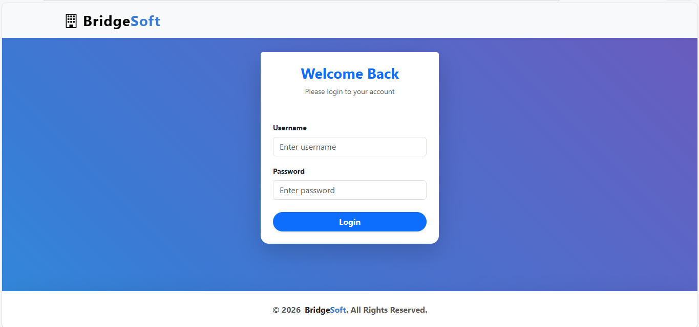
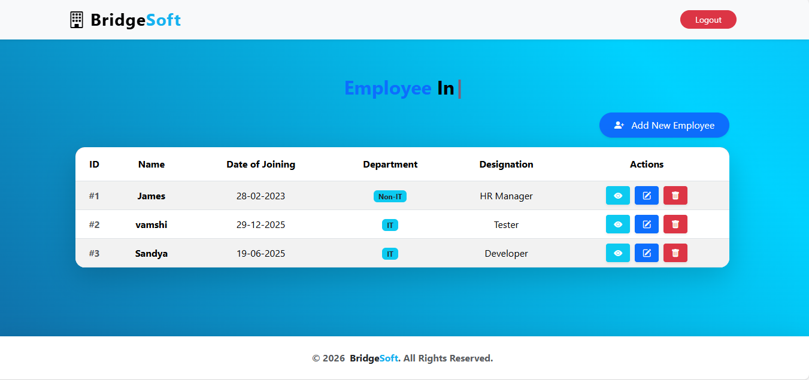
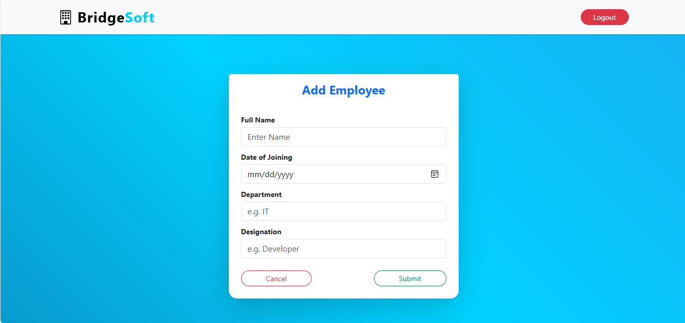
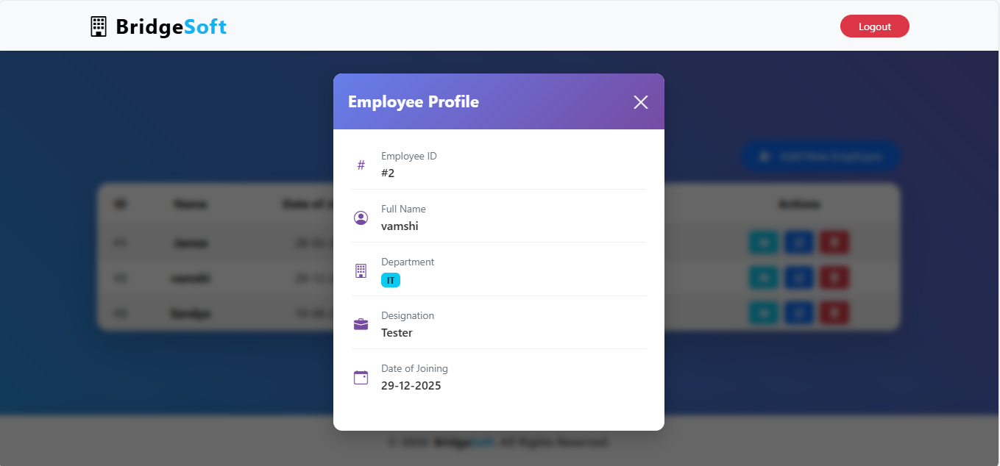
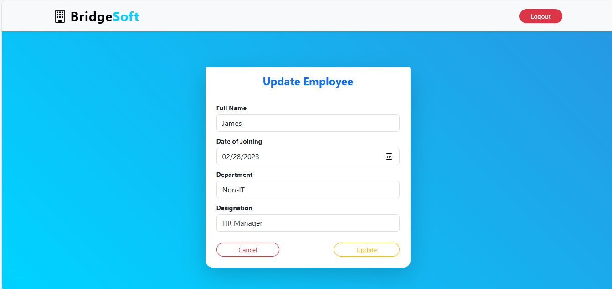
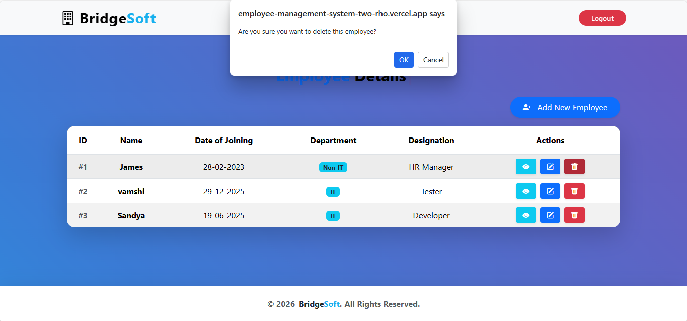

# 🚀 Employee Management System (Full Stack)


A robust, full-stack web application designed to streamline employee data management. Built with a **Spring Boot** backend and a **React (Vite)** frontend, this system features secure REST APIs, a cloud-hosted MySQL database, and automated deployment pipelines via Render and Vercel.

---

## 🌐 Live Demo

| Component | Status | Link |
| :--- | :--- | :--- |
| **Frontend (UI)** | 🟢 Live | [**Click to View App**](https://employee-management-system-two-rho.vercel.app) |
| **Backend (API)** | 🟢 Live | [View API Health](https://employee-management-system-orwg.onrender.com/api/employees) |

---

## 🔑 Demo Credentials
To test the application features (Add/Edit/Delete Employees), please use the following demo account:

* **Username / Email:** `admin`
* **Password:** `admin123`

> **Note:** You can also register a new user if you prefer!
 
---

## 📸 Screenshots

| **Login Page** | **Employee List** |
|:---:|:---:|
|  |  |

| **Add Employee** | **View Details** |
|:---:|:---:|
|  |  |

| **Update Details** | **Delete Employee** |
|:---:|:---:|
|  |  |

---

## 🛠️ Tech Stack

### **Backend**
* **Framework:** Spring Boot (Java 21)
* **Database:** MySQL (Hosted on Aiven Cloud)
* **Build Tool:** Maven
* **Containerization:** Docker (Multi-stage build)
* **Deployment:** Render

### **Frontend**
* **Library:** React.js (Vite)
* **Styling:** Bootstrap / CSS
* **HTTP Client:** Axios
* **Deployment:** Vercel

---

## ✨ Key Features
* **Full CRUD Operations:** Create, Read, Update, and Delete employee records.
* **RESTful API Architecture:** Clean and scalable backend API endpoints.
* **Cloud Database Integration:** Data persists securely in a remote MySQL database.
* **Cross-Origin Resource Sharing (CORS):** Secure communication between the React frontend and Spring Boot backend.
* **Dockerized Deployment:** Backend is containerized using Docker for consistent runtime environments.

---

## 📂 Project Structure

This project is organized as a Monorepo, containing both the **Frontend** (React) and **Backend** (Spring Boot) applications.

```bash
Employee-Management-System/
├── LICENSE
├── README.md
├── .gitignore
├── Screenshots/
│   ├── Login_page.png
│   ├── Employee_List.png
│   ├── Add_Employee.png
│   ├── View_Employee.png
│   ├── Update_page.png
│   └── Delete_Employee.png
│
├── react-workspace/            # Frontend Directory
│   └── frontend/
│       ├── public/
│       ├── src/
│       │   ├── components/     # Reusable React components
│       │   ├── services/       # API service files (Axios)
│       │   ├── App.jsx         # Main Component
│       │   └── main.jsx        # Entry Point
│       ├── package.json        # Frontend dependencies
│       ├── vite.config.js      # Vite configuration
│       └── vercel.json         # Vercel deployment config (Routing fix)
│
└── sb-workspace/              # Backend Directory
    └── backend/
        ├── src/
        │   └── main/java/com/example/ems/
        │       ├── controller/  # REST Controllers
        │       ├── model/       # JPA Entities
        │       ├── repository/  # Database Repositories
        │       ├── service/     # Business Logic
        │       └── exception/   # Custom Exception Handlers
        ├── Dockerfile           # Docker configuration for Render
        ├── pom.xml              # Maven dependencies
        └── mvnw                 # Maven Wrapper

```
---

## ⚙️ How It Works

The application follows a modern **Client-Server Architecture** with a clear separation of concerns:

1.  **Frontend Interaction (React & Axios)**
    * The user interacts with the UI (e.g., clicking "Add Employee").
    * React uses **Axios** to dispatch an asynchronous HTTP request (GET, POST, PUT, DELETE) to the Spring Boot Backend API.
    * Example: Submitting the form sends a `POST` request with a JSON object containing the employee's details.

2.  **Backend Processing (Spring Boot)**
    * The **Controller Layer** (`EmployeeController`) receives the HTTP request.
    * The request is passed to the **Service Layer** (`EmployeeService`), which handles business logic.
    * The **Repository Layer** (`EmployeeRepository`) uses **Spring Data JPA** to communicate with the database.

3.  **Data Persistence (MySQL)**
    * Hibernate (inside Spring Boot) translates the Java objects into SQL queries.
    * The data is securely stored or retrieved from the **Aiven Cloud MySQL Database**.

4.  **Response Cycle**
    * The backend returns a standard HTTP response (e.g., `200 OK` or `201 Created`) along with the data in **JSON format**.
    * The React Frontend receives this response and dynamically updates the DOM to display the new data without reloading the page.

---
